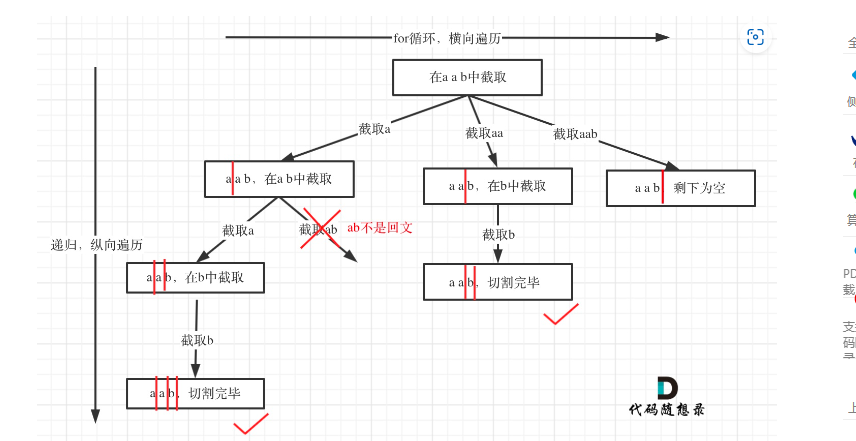

## 131.分割回文串
### 递归
#### 思路
- 横向遍历纵向递归
- 本题中startindex作为切割线，那么递归终止条件就是切割到字符串末尾：startIndex>=s.length
- 切割出来的子串区间为：[startIndex,i] 
- 每次截取出来通过双指针判断子串是否为回文串，如果是加入到path数组中，不是的话继续切割
- 横向切割完后纵向递归切割子串


```java
class Solution {
    List<List<String>> result = new ArrayList<>();
    List<String> path = new ArrayList<>();
    public List<List<String>> partition(String s) {
        backTracking(s,0);
        return result;
    }

    public void backTracking(String s, int startIndex){
        if (startIndex>=s.length()){
            result.add(new ArrayList<>(path));
            return;
        }
        for (int i = startIndex; i < s.length() ; i++) {
            if (isPalindrome(s,startIndex,i)){
                path.add(s.substring(startIndex,i+1));
            }else {
                continue;
            }
            backTracking(s,i+1);
            path.remove(path.size()-1);
        }
    }

    public boolean isPalindrome(String s,int start,int end){
        for (int i = start,j = end; i < j; i++,j--) {
            if (s.charAt(i) != s.charAt(j)) {
                return false;
            }
        }
        return true;
    }
}
```
