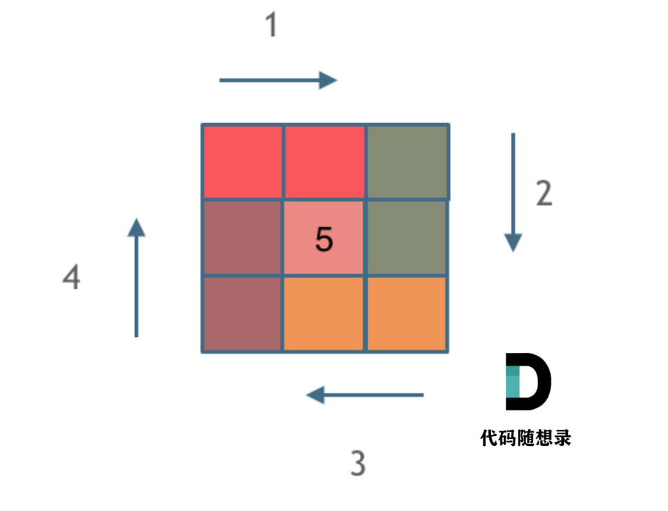

## 59.螺旋矩阵

> 因为边界条件特别多所以很容易绕进去,应遵循**循环不变量原则**将矩阵拆解

1. 应用左闭右开的原则,矩阵可以拆解为多个上下左右4条边的正方形套圈组合,拆解图如下;
2. 如果n为奇数的话中心为单个数字n^2



```java
class Solution {
    public int[][] generateMatrix(int n) {
        int loop = 0;  // 控制循环次数
        int[][] res = new int[n][n];
        int start = 0;  // 每次循环的开始点(start, start)
        int count = 1;  // 定义填充数字
        int i, j;

        while (loop++ < n / 2) { // 判断边界后，loop从1开始
            // 模拟上侧从左到右
            for (j = start; j < n - loop; j++) {
                res[start][j] = count++;
            }

            // 模拟右侧从上到下
            for (i = start; i < n - loop; i++) {
                res[i][j] = count++;
            }

            // 模拟下侧从右到左
            for (; j >= loop; j--) {
                res[i][j] = count++;
            }

            // 模拟左侧从下到上
            for (; i >= loop; i--) {
                res[i][j] = count++;
            }
            start++;
        }

        if (n % 2 == 1) {
            res[start][start] = count;
        }

        return res;
    }
}
```