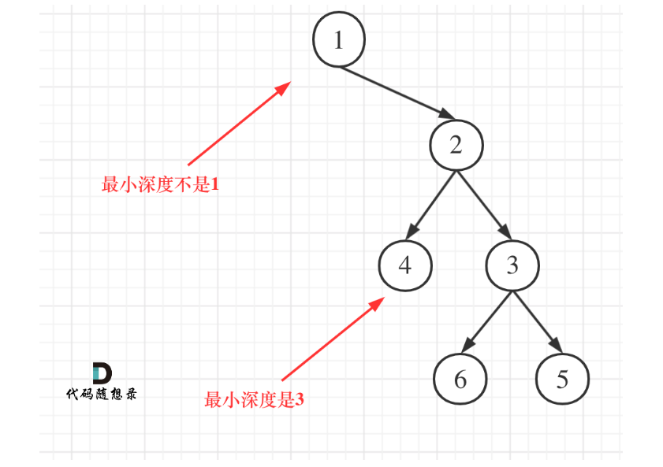

## 111.二叉树的最小深度

### 递归实现
#### 思路
- 搜先明确题目中是求出到叶子节点的最小深度，所以最小深度对应的节点的左右叶子都为空才算如图所示

- 由此在一题最大深度的基础上调整单层处理逻辑
```java
class Solution {
    public int minDepth(TreeNode root) {
        return getMinDepth(root);
    }

    public int getMinDepth(TreeNode cur){
        if (cur == null) return 0;
        int left = getMinDepth(cur.left);
        int right = getMinDepth(cur.right);
        // 左右叶子节点都为空的节点才算数所以有如下三种情况
        // 如果左叶子节点不为空右叶子节点为空，那么计算左叶子节点对应的最小深度
        if (cur.left != null && cur.right == null) {
            return 1+left;
        }
        // 如果右叶子节点不为空，且左叶子节点为空，那么查找右叶子节点的最小深度并+1返回
        if (cur.right != null && cur.left == null) {
            return 1+right;
        }
        // 如果都为空返回最小值
        return 1+Math.min(left,right);
    }
}
```