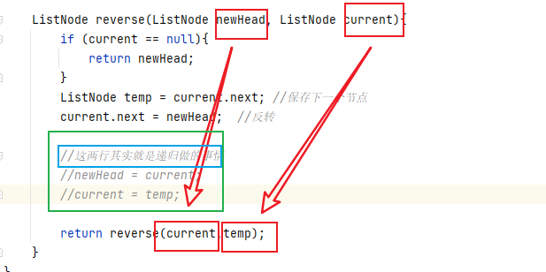

## 206.反转链表

### 迭代
- 时间复杂度O(n)
- 空间复杂度O(1)

- 需要注意将上一次的头节点与新的头节点连接,其它就是正常断开重新连接的操作了

```java
class Solution {
    public ListNode reverseList(ListNode head) {

        if (head == null) {
            return head; //如果是空链表直接返回
        }

        ListNode current = head; //记录当前指针节点
        ListNode newHead = head; //需要返回的新链表
        while (current.next != null) { //当链表尾端终止
            head = newHead; //记录上次循环的头节点,以便后续新翻转过来的头节点连接
            newHead = current.next; //新的头节点
            current.next = current.next.next; //当前节点指向下下节点
            newHead.next = head; //新头节点连接旧头节点
        }
        return newHead;
    }
}
```

### 双指针法--这个更好理解哎

- 看下面**代码随想录**总结的动图就好了


```java
class Solution {
    public ListNode reverseList(ListNode head) {

        if (head == null) {
            return head; //如果是空链表直接返回
        }

        //双指针
        ListNode current = head; //记录当前指针节点
        ListNode newHead = null; //需要返回的新链表
        ListNode temp = head;
        while (current != null) { //当链表尾端终止
            temp = current.next; //记录当前节点的下一节点备用,等会要重新连回到current
            current.next = newHead; 
            newHead = current;
            current = temp;
        }
        return newHead;
    }
}
```


### 递归

>递归其实就是做了双指针交换的事情,如图



- 时间复杂度O(logn)
- 空间复杂度O(1)

```java
class Solution {
    public ListNode reverseList(ListNode head) {

        if (head == null) {
            return head; //如果是空链表直接返回
        }
        return reverse(null,head);
    }

    ListNode reverse(ListNode newHead, ListNode current){
        if (current == null){
            return newHead;
        }
        ListNode temp = current.next;
        current.next = newHead;
        return reverse(current,temp);
    }
}
```