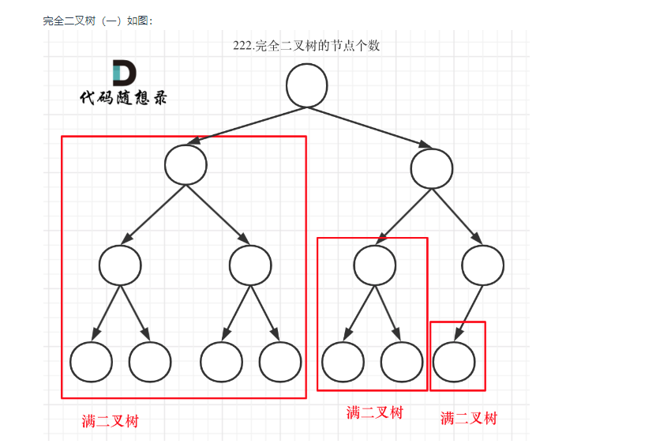
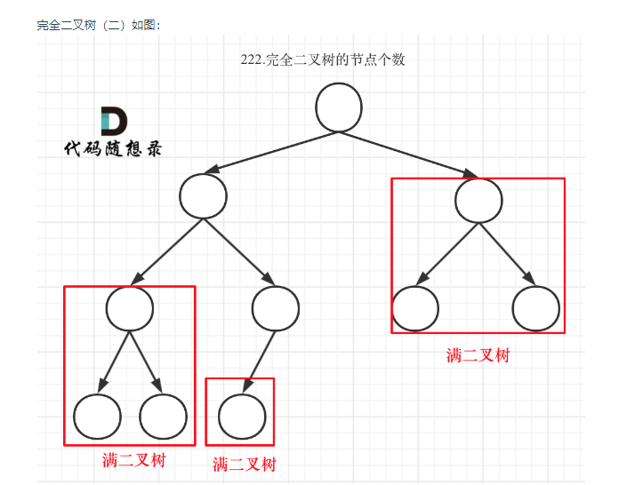

## 222.完全二叉树节点个数

### 递归遍历
#### 思路
- 后序递归遍历
- 入参--出参：当前节点--累加节点数
- 递归终止条件：节点为空
- 每层递归执行逻辑:当前节点加左右节点
```java
if (root == null) return 0;
int left = countNodes(root.left);
int right = countNodes(root.right);
return 1+left+right;
```

- 具体代码如下
```java
class Solution {
    public int countNodes(TreeNode root) {
        if (root == null) return 0;
        int left = countNodes(root.left);
        int right = countNodes(root.right);
        return 1+left+right;
    }
}
```

- 时间复杂度：O(n) ,通过**Master**公式计算得出
- 空间复杂度：O(nlogn)

### 层序遍历-迭代

- 在层序遍历的基础上计算节点数就可以了

```java
class Solution {
    public int countNodes(TreeNode root) {
        Deque<TreeNode> deque = new LinkedList<>();
        if (root!= null) deque.push(root);
        // 总结点数
        int sum = 0;
        while (!deque.isEmpty()) {
            int size = deque.size();
            //累计每层节点数
            sum+=size;
            while (size-->0){
                TreeNode node = deque.pollLast();
                if (node.left != null) deque.push(node.left);
                if (node.right != null) deque.push(node.right);
            }
        }
        return sum;
    }
}
```
- 时间复杂度：O(n)
- 空间复杂度：O(n)

### 通过完全二叉树的特性求出
- 首先明确两点
  1. 满二叉树的节点个数可以通过公式计算2^深度-1；
  2. 完全二叉树末端一定是由多个满二叉树组成，如图所示


- 综上可以利用二叉树末端一定是多个满二叉树组成并且满二叉树只需要直到深度就可以计算节点数的特性节本题
  1. 遍历左右子树：只向左，只向右遍历如果最后两边的深度相等那么就是满二叉子树，计算节点数+1返回
  2. 如果不等递归遍历子树

```java
class Solution {
    public int countNodes(TreeNode root) {
        // 递归终止条件
        {
            if (root == null) return 0;

            // 子树左右深度
            int leftDepth = 0;
            int rightDepth = 0;
            TreeNode left = root.left;
            TreeNode right = root.right;
            while (left != null){
                left = left.left;
                leftDepth++;
            }
            while (right != null){
                right = right.right;
                rightDepth++;
            }
            // 如果是满二叉树返回二叉子树节点数
            if (rightDepth==leftDepth){
                return (2<<leftDepth)-1;
            }
        }

        //单层递归逻辑
        int left = countNodes(root.left);
        int right = countNodes(root.right);
        return 1+left+right;
    }
}
```

- 时间复杂度O(logn × logn)
- 空间复杂度O(logn)

