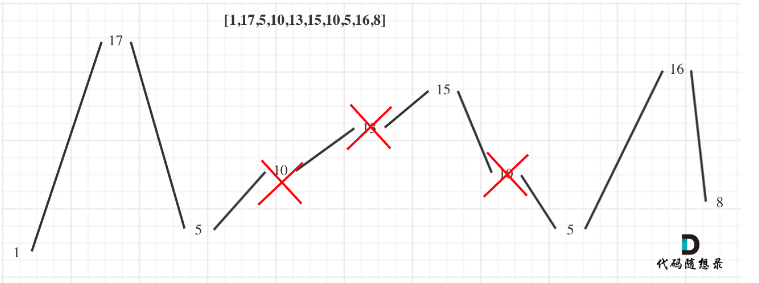

## 376.摆动序列
### 贪心算法
#### 思路
- 计算序列中峰值最多的子序列



- 注意点,节点数要从1开始(默认最右边有一个峰值,数组长度为1的)
- 判断前一个高度差与当前高度差一正一负那么就是一个峰值

```java
class Solution {
    public int wiggleMaxLength(int[] nums) {
        if (nums.length<=1){
            return nums.length;
        }

        int preDiff = 0;
        int curDiff = 0;
        int count = 1;
        for (int i = 1; i < nums.length; i++) {
            curDiff = nums[i] - nums[i-1];
            // 这里等于0是判断第一个峰值:prediff初始为0
            if ((curDiff>0 && preDiff<=0) || (curDiff<0 && preDiff>=0)){
                preDiff = curDiff;
                count++;
            }
        }
        return count;
    }
}
```

### 动态规划
#### 思路
