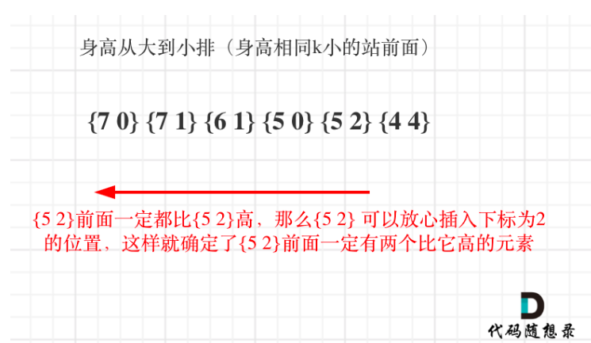

## 406.根据身高重建队列
### 贪心
#### 思路
- 因为每个人的第二个元素代表前面是多少个比自己高的,所以根据身高从大到小排序
- 身高相同的前面人数小的在前面
- 然后创建一个链表不断根据前面人数当作插入索引插入链表位置


```java
class Solution {
    public int[][] reconstructQueue(int[][] people) {
        //身高从大到小排序,身高相同k小的在前面
        Arrays.sort(people,(a,b) -> {
            if (a[0] == b[0]) return a[1] - b[1];
            return b[0] -a[0];
        } );

        LinkedList<int[]> que = new LinkedList<>();
        for (int[] person : people) {
            que.add(person[1],person);
        }
        return que.toArray(new int[people.length][]);
    }
}
```