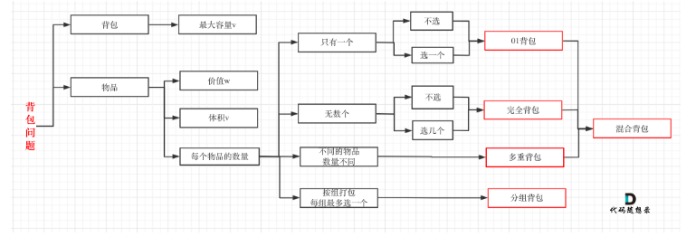
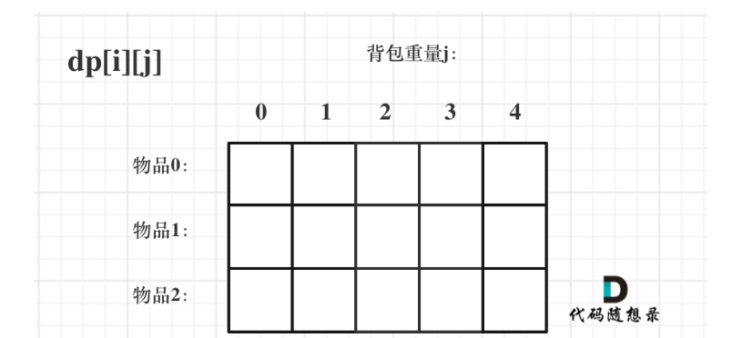

# 一.背包问题理论
> 背包问题面试的话只需要掌握01背包和完全背包就够用了
> 完全背包是01背包变化来的

## 背包问题一共哪几类


## 01背包
>有n件物品和一个最多能背重量为w 的背包。第i件物品的重量是weight[i]，得到的价值是value[i] 。每件物品只能用一次，求解将哪些物品装入背包里物品价值总和最大。

这是标准的背包问题，以至于很多同学看了这个自然就会想到背包，甚至都不知道暴力的解法应该怎么解了。

这样其实是没有从底向上去思考，而是习惯性想到了背包，那么暴力的解法应该是怎么样的呢？

每一件物品其实只有两个状态，取或者不取，所以可以使用回溯法搜索出所有的情况，那么时间复杂度就是$o(2^n)$，这里的n表示物品数量。

所以暴力的解法是指数级别的时间复杂度。进而才需要动态规划的解法来进行优化！

在下面的讲解中，我举一个例子：

背包最大重量为4。

物品为：

|  |重量|价值|
|--|--|--|
|物品0|1|15|
|物品1|3|20|
|物品2|4|30|

问背包能背的物品最大价值是多少？

### 二维
#### 思路
- 动规五部曲
1. 确定dp数组下标及其含义: dp[i][j] 表示:下标为[0-i]的物品任意取所能放入背包j的最大重量

2. 确定递推公式,有两个方向判断:能放下物品i和不能放下物品i
   3. 不放物品i的话:dp[i][j] = dp[i-1][j] (意思就是当加上i的重量后超出背包容量,那么背包j所能存放的最大容量是由前面的物品确定);
   4. 放物品i的话: dp[i][j] = dp[i-1][j-weight[i]] + value[i] (意思就是j-weight[i] 的最大价值加上物品i的最大价值
      5. 这里**j-weight[i]** 的含义就是预留weight[i]的空间存放物品i,
      6. 这里**dp[i-1][j-weight[i]]**的含义就是**j-weight[i]的背包容量下不放物品i所能达到的最大价值** 
      7. 然后再**加上物品i的价值**就是当前**存放物品i所能达到的最大价值**
3. 遍历顺序从左到右,注意这里行和列可以交换前后顺序即:先遍历行再遍历列,先遍历列再遍历行都可以,因为dp[i][j]的值由左上角(放物品i)或者上方(不放物品i)两个方向推导,
4. 初始化: j=0存放的价值都是0,i = 0是要根据背包容量以及物品重量分情况初始化

- 

```java
class Solution {
   public static void main(String[] args) {
      int[] weight = new int[]{1, 3, 4};
      int[] value = new int[]{15, 20, 30};
      int bag = 4;


      int[][] dp = new int[weight.length][bag + 1];

      // 初始化第一列
      for (int i = 0; i < dp.length; i++) {
         dp[i][0] = 0;
      }
      // 初始化第一行
      for (int j = 1; j <= bag; j++) {
         dp[0][j] = weight[0] > j ? 0 : value[0];
      }

      for (int i = 1; i < weight.length; i++) {
         for (int j = 1; j <= bag; j++) {
            if (weight[i] <= j) { //如果放得下物品i 
               dp[i][j] = Math.max(dp[i - 1][j - weight[i]] + value[i], dp[i - 1][j]);
            } else { //放不下物品i
               dp[i][j] = dp[i - 1][j];
            }
         }
      }

      System.out.println(Arrays.deepToString(dp));

   }
}
```
### 一维
#### 思路
- 动规五部曲
1. 确定dp数组及下标含义:dp[i] = 背包容量为j所能存放物品最大价值
2. 确定递推公式：
   3. 放不下放物品i 那么dp[j] 等于上一轮[0->i-1]的最大价值对应的dp[j]；即不放物品i时dp[j] = dp[j]
   4. 放的下物品i：dp[j] 等于**背包j**先腾出**物品i**的容量,然后计算腾出容量后相应容量所能存放的最大价值：dp[j-weight[i]] ;再**加上物品i**的价值;即 放物品i时 dp[j] = dp[j-weight[i]] + value[i]
3. 递推方向: 物品按照从左往右存放,背包按照从右向左
   4. 根据递推公式: dp[j] = dp[j-weight[i]];如果按照从左向右遍历的话物品i会被放入多次 比如:
      5. i = 物品0 重量为1, 价值为15 : dp[1] = dp[1-weight[0]] +value[0] = 15; dp[2] = dp[2-weight[0]] + value[0] = 30; 这样物品0 就被放入两次
   6. 不能先遍历背包再遍历物品,因为背包是倒序从右向左遍历如果先遍历背包的话递推公式中只能存放一个物品,
      7. 因为在内层for循环物品时dp[j-weight[i]]始终是0,
      7. 背包放在内层就不会了,每个背包容量都会根据当前物品初始化一个值遍历下一个物品时再当前物品的基础上做处理
7. 初始化: dp[0] = 0;

```java
public class Bag_01 {
    
   public static void bag_01_一维(int[] weight, int[] value, int bag) {
      int[] dp = new int[bag + 1];

      dp[0] = 0;

      for (int i = 0; i < weight.length; i++) {
         for (int j = bag; j >= weight[i]; j--) {
            dp[j] = Math.max(dp[j - weight[i]] + value[i], dp[j]);
         }
      }
      System.out.println(Arrays.toString(dp));
   }

}

```

# 01背包应用算法题
## 416.分割等和子集
### 动态规划
#### 思路
- 这道题的关键点是找出任意组和数组中的元素是否有等于 **总和除以二的组和**
- 那么这道题就可以拆解为01背包问题:背包容量为[0-sum/2] 找出任意组和元素[0-nums.length] 看是否有某个组和dp[sum/2] = sum/2
- 这道题中**背包容量为[0-sum/2]**, **物品以及物品的价值为nums数组中的每个元素**
- dp五部曲
1. dp[j] 表示nums[0-i]任取j个元素的和最大值
2. 递推公式: 取i dp[j-nums[i]]+nums[i] 和不取i dp[j]
3. 遍历方向在上面背包问题中已经解释这里用一维的话就是先便利nums 从前到后,后遍历背包从后向前
4. 初始化dp[0] = 0; 背包0能放0个物品 **翻译到这个题就是切割长度为0的组和总和为0**

```java
class Solution {
    public boolean canPartition(int[] nums) {

        int sum = 0;
        for (int num : nums) {
            sum += num;
        }
        if (sum%2 == 1) return false;
        //dp[j] 表示nums[0-i]任取j个元素的和最大值, 取最大值才能最接近sum/2
        int[] dp = new int[sum/2+1];
        dp[0] = 0;
        for (int i = 0; i < nums.length; i++) {
            for (int j = sum/2; j >= nums[i]; j--) {
                dp[j] = Math.max(dp[j-nums[i]] + nums[i],dp[j]);
            }
        }
        return dp[sum/2] == sum/2;
    }
}
```

- 时间复杂度 O(n^2) 两层for循环
- 空间复杂度O(n) dp数组长度

