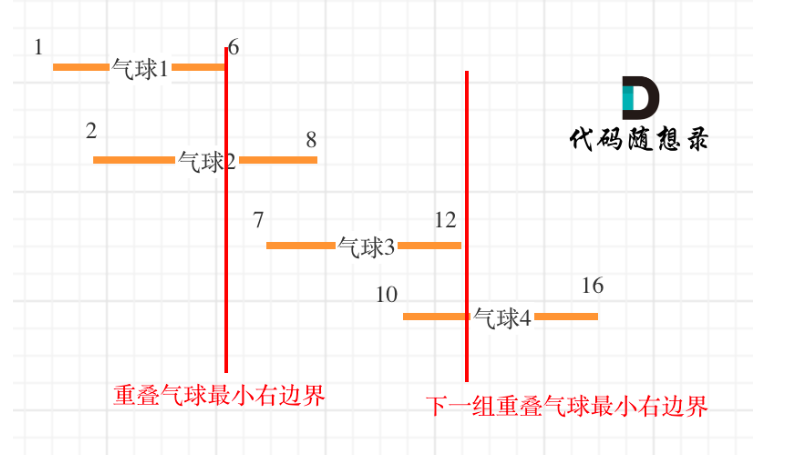

## 452.用户最少数量的箭引爆气球
### 贪心
#### 思路
- 首先根据气球的开始坐标从小到大排序
- 然后遍历气球,判断前后两个气球是否有重合部分如果重合就能引爆,如果不重合需要增加一支箭
- 另外如果重合的话箭至少要指向右边界的最小值才能引爆,所以需要更新最小右边界



```java
class Solution {
    public int findMinArrowShots(int[][] points) {
        if (points.length == 0) return 0;
        //使用气球的开始坐标从小到大排序
        Arrays.sort(points, Comparator.comparingInt(a -> a[0]));
        int result = 1; //如果points长度不为0时至少需要一支箭
        for (int i = 1; i < points.length; i++) {
            // 如果当前气球的左边界跟前一个气球的有边界没有挨着，不会引爆，箭数加一
            if (points[i][0] > points[i-1][1]){
                result ++;
            }else {
                //更新最小右边界
                points[i][1] = Math.min(points[i][1],points[i-1][1]);
            }
        }
        return result;
    }
}
```