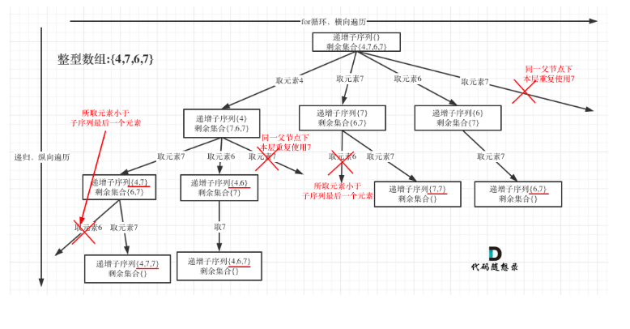

## 491.递增子序列
#### 思路
- 注意本题性质不能对数组重新排序，所以在处理层级重复时只能使用used数组判断不能通过前后元素是否重复判断
- 两个注意点：
1. 题目中说明不能有重复子序列所以，需要在树层中去重重复
2. 需要子序列为递增序列，所以需要在树枝中排除当前叶子节点小于父节点的分支



```java
class Solution {
    List<List<Integer>> result = new ArrayList<>();
    List<Integer> path = new ArrayList<>();
    public List<List<Integer>> findSubsequences(int[] nums) {
        backTracking(nums,0);
        return result;
    }

    public void backTracking(int[] nums, int startIndex){
        if (path.size() >=2){
            result.add(new ArrayList<>(path));
        }

        Map<Integer,Integer> used = new HashMap();

        for (int i = startIndex; i < nums.length; i++) {
            //层级去重
            //由于本题限制固定顺序用以下方式判断层级重复会有问题要用used数组判断
            // if (i>startIndex && nums[i] == nums[i-1]){
            //     continue;
            // }
            if (used.containsKey(nums[i])){
                continue;
            }
            //叶子级别判断大小保证递增:  path为空或则path最后一个元素小于当前元素
            if (path.isEmpty() || nums[i]>=path.get(path.size()-1)){
                used.put(nums[i],nums[i]);
                path.add(nums[i]);
                backTracking(nums,i+1);
                path.remove(path.size()-1);
            }
        }
    }
}
```