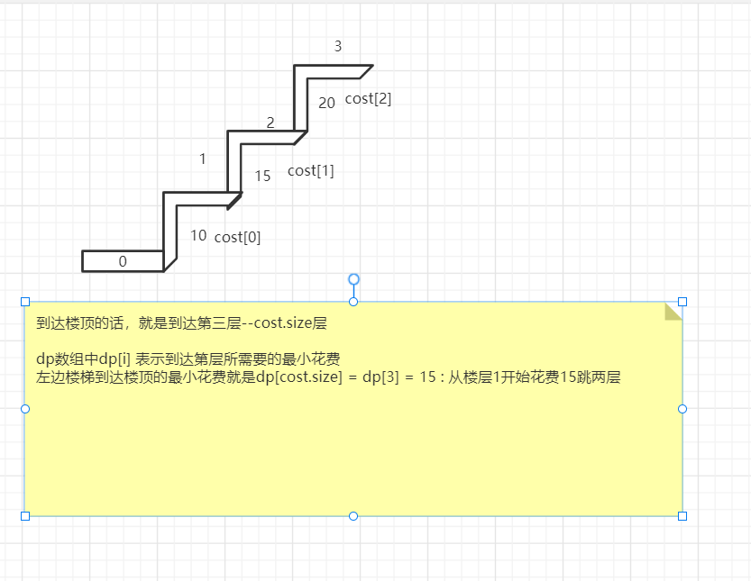

## 746.使用最小花费爬楼梯
### 动规
#### 思路
- 首先画图可以看出dp数组与cost是错位的，设计dp数组时要考虑这个

- 递归5步曲
  1.确定dp数组及下标含义：dp[i] = 第i层的最小花费
  2.确定递推公式：dp[i] = min（dp[i-1]，dp[i-2]）+cost[i], 由于之前分析与cost的错位，最后一层不用加cost[i]
  3.数组如何初始化： dp[0] = cost[0]; dp[1] = cost[1];
  4.确定遍历顺序：从递归公式dp[i] = min（dp[i-1]，dp[i-2]）+cost[i];中可以看出，dp[i]是依赖 dp[i - 1] 和 dp[i - 2]，那么遍历的顺序一定是从前到后遍历的
  5. 举例推到dp数组：看上面的 楼梯图即可;
```java
class Solution {
    public int minCostClimbingStairs(int[] cost) {
        // 1.确定dp数组及下标含义：dp[i] = 第i层的最小花费
        // 2.确定递推公式：dp[i] = min（dp[i-1]，dp[i-2]）+cost[i], 由于之前分析与cost的错位，最后一层不用加cost[i]
        // 3.数组如何初始化： dp[0] = cost[0]; dp[1] = cost[1];
        // 4.确定遍历顺序：从递归公式dp[i] = min（dp[i-1]，dp[i-2]）+cost[i];中可以看出，dp[i]是依赖 dp[i - 1] 和 dp[i - 2]，那么遍历的顺序一定是从前到后遍历的
        // 5. 举例推到dp数组;
        int[] dp = new int[cost.length];
        dp[0] = cost[0];
        dp[1] = cost[1]; //因为可以从0层或则1层出发
        for (int i = 2; i < cost.length; i++) {
            dp[i] = Math.min(dp[i-1],dp[i-2]) +cost[i];
        }
        //最后一步不用花费也就没有对应的cost[cost.length] --- 可以画楼梯图看出cost与dp的小标是错位的
        return Math.min(dp[cost.length-1],dp[cost.length-2]);
    }
}
```