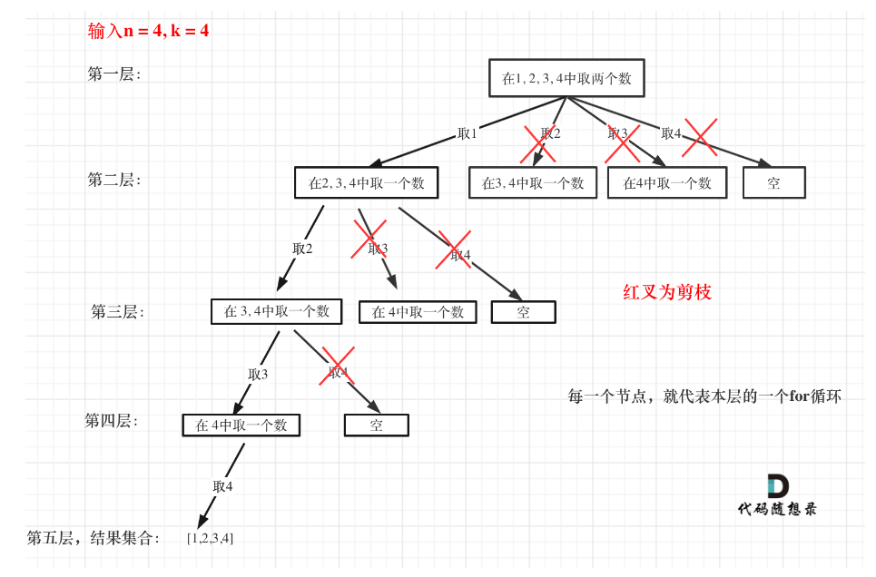

# 一. 回溯算法理论基础

### 回溯算法本质上就是穷举

### 回溯算法主要解决的问题
- 组合问题：N个数里面按一定规则找出k个数的集合
- 切割问题：一个字符串按一定规则有几种切割方式
- 子集问题：一个N个数的集合里有多少符合条件的子集
- 排列问题：N个数按一定规则全排列，有几种排列方式
- 棋盘问题：N皇后，解数独等等

### 组合和排列的区别

- 组合强调无序性
- 排列强调顺序，相同元素不同顺序的排列

### 回溯算法代码模板

```java
void backtracking(参数) {
    if (终止条件) {
        存放结果;
        return;
    }

    for (选择：本层集合中元素（树中节点孩子的数量就是集合的大小）) {
        //处理节点;
        backtracking(路径，选择列表); // 递归
        // 递归完回溯，撤销处理结果
    }
}

```

# 二. 回溯相关算法题

## 77.组合

### 回溯模板
#### 思路
- 递归组合符合长度的子数组，当组成符合长度的子数组就记录结果然后回溯弹出子数组最后一个元素

```java
class Solution {
    List<List<Integer>> result = new ArrayList<>();
    List<Integer> path = new ArrayList<>();
    public List<List<Integer>> combine(int n, int k) {
        backTracking(n,k,1);
        return result;
    }

    public void backTracking(int n, int k, int startIndex) {
        if (path.size() == k) {
            result.add(new ArrayList<>(path)); //存放结果
            return;
        }

        for (int i = startIndex; i<=n; i++) {
            path.add(i);
            backTracking(n,k,i+1); // 递归
            path.remove(path.size()-1);
        }
    }
}
```

### 剪枝
#### 思路
- 如果n=k，时其实小于k后面长度的递归就没有意义了
 
- 接下来看一下优化过程如下：

1. 已经选择的元素个数：path.size();
2. 还需要的元素个数为: k - path.size();
3. 在集合n中至多要从该起始位置 : n - (k - path.size()) + 1，开始遍历

- 优化后的代码
```java
class Solution {
    List<List<Integer>> result = new ArrayList<>();
    List<Integer> path = new ArrayList<>();
    public List<List<Integer>> combine(int n, int k) {
        backTracking(n,k,1);
        return result;
    }

    public void backTracking(int n, int k, int startIndex) {
        if (path.size() == k) {
            result.add(new ArrayList<>(path)); //存放结果
            return;
        }

        for (int i = startIndex; i<=n-(k-path.size())+1; i++) {
            path.add(i);
            backTracking(n,k,i+1); // 递归
            path.remove(path.size()-1);
        }
    }
}
```
