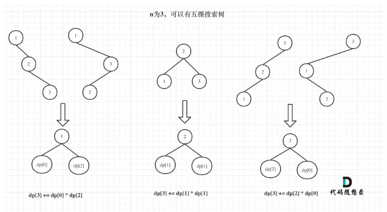

## 96.不同二叉树
### 动态规划
#### 思路
- 难点在与递推公式的确定,可分别让每个节点作为头部节点这样的话每种头部节点对应的组和如下图所示



- 公式为: dp[3] = dp[2]*dp[0]+dp[1]*dp[1]+dp[2]*dp[0]
- 如上就可以增加一层for循环组装每种头节点的情况
- 相应的公式为:dp[i] += dp[j-1]*dp[i-j];

```java
class Solution {
    public int numTrees(int n) {
        int[] dp = new int[n+1];
        dp[0] = 1;
        for (int i = 1; i <=n; i++) {
            for (int j = 1; j <=i ; j++) {
                dp[i] += dp[j-1]*dp[i-j];
            }
        }
        return dp[n];
    }
}
```